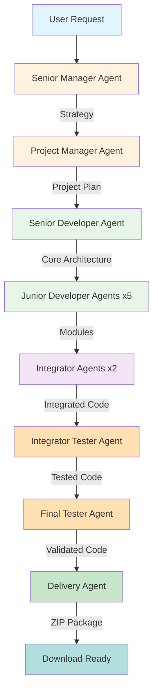

# 🤖 AI Project Manager - Autonomous Full-Stack Project Generator

<div align="center">


**Transform ideas into production-ready code with AI-powered autonomous agents**

[Features](#-features) • [Architecture](#-architecture--agent-workflow) • [Installation](#-installation) • [Usage](#-usage) • [API Documentation](#-api-documentation) • [Limitations](#%EF%B8%8F-current-limitations)

</div>

---

## 📖 Overview

The **AI Project Manager** is an advanced, autonomous system that generates complete full-stack software projects from natural language descriptions. Powered by **CrewAI**, **FastAPI**, and **LangChain**, it orchestrates a team of specialized AI agents that collaborate through the entire Software Development Lifecycle (SDLC) - from strategic planning to code delivery.

### 🎯 What Makes This Special?

- **🔒 Privacy-First**: Runs entirely on local LLMs via Ollama - no data leaves your machine
- **🤝 Multi-Agent Collaboration**: 8+ specialized AI agents working in harmony
- **⚡ Production-Ready Output**: Generates complete, tested, and documented projects
- **🎨 Full-Stack Capable**: Supports web apps, APIs, data analysis, and ML projects
- **📦 One-Click Delivery**: Download complete projects as ZIP files
- **🔄 Real-Time Tracking**: Monitor progress through each development phase

---

## ✨ Features

### Core Capabilities

| Feature | Description |
|---------|-------------|
| **Autonomous Generation** | From idea to downloadable ZIP in one API call |
| **Multi-Agent Architecture** | Hierarchical team of specialized agents (Managers, Developers, Testers) |
| **Local LLM Support** | Privacy-focused using Ollama (Mistral, Starcoder2, CodeLlama) |
| **RESTful API** | Clean endpoints for project assignment, status tracking, and downloads |
| **Real-Time Status** | Track progress through planning, development, testing, and delivery phases |
| **Async Processing** | Handle multiple project requests concurrently |
| **Web Interface** | Simple, modern UI for non-technical users |
| **Comprehensive Testing** | Automated integration and validation testing |

### Supported Project Types

- ✅ **Full-Stack Web Applications** (React, Vue, Angular + FastAPI/Express)
- ✅ **REST APIs & Microservices**
- ✅ **Data Analysis Projects** (EDA, visualization, statistical analysis with scikit-learn datasets)
- ✅ **Machine Learning Projects** (scikit-learn based models and pipelines)
- ✅ **CLI Tools & Utilities**
- ✅ **Database-Driven Applications**
- ✅ **Custom Requirements**

---

## 🏗️ Architecture & Agent Workflow

The system employs a **hierarchical multi-agent workflow** inspired by real software development teams:



### 🔄 Development Phases

#### **Phase 1: Strategy & Planning**
- **Senior Manager Agent** (`mistral:7b-instruct`)
  - Analyzes project requirements
  - Defines high-level architecture strategy
  - Identifies technical challenges and solutions
  
- **Project Manager Agent** (`mistral:7b-instruct`)
  - Breaks down strategy into actionable tasks
  - Creates detailed project plan
  - Defines success criteria

#### **Phase 2: Core Development**
- **Senior Developer Agent** (`starcoder2:7b`)
  - Implements core architecture and scaffolding
  - Sets up project structure
  - Creates foundational components
  - Delegates subtasks to junior developers

#### **Phase 3: Module Development**
- **Junior Developer Agents** (5x `codellama:7b`)
  - Implement specific features in parallel
  - Build individual modules and components
  - Follow senior developer's architecture

#### **Phase 4: Integration**
- **Integrator Agents** (2x `mistral:7b-instruct`)
  - Merge core and module code
  - Resolve conflicts and dependencies
  - Ensure component compatibility
  - Create unified codebase

#### **Phase 5: Integration Testing**
- **Integrator Tester Agent** (`starcoder2:7b`)
  - Tests integrated components
  - Identifies and fixes integration issues
  - Generates test suites
  - Validates functionality

#### **Phase 6: Final Validation**
- **Final Tester Agent** (`starcoder2:7b`)
  - Performs comprehensive testing
  - Validates against original requirements
  - Ensures code quality standards
  - Creates additional test coverage

#### **Phase 7: Delivery**
- **Delivery Agent** (`mistral:7b-instruct`)
  - Prepares final documentation (README, setup guides)
  - Organizes project structure
  - Creates deployment instructions
  - Packages everything into a ZIP file

---

## 🛠️ Tech Stack

### Backend & Core
- **FastAPI** - Modern, high-performance web framework
- **Uvicorn** - Lightning-fast ASGI server
- **Pydantic** - Data validation and settings management
- **Python 3.10+** - Modern Python features

### AI & Orchestration
- **CrewAI** - Multi-agent orchestration framework
- **LangChain** - LLM application framework
- **Ollama** - Local LLM serving platform

### LLM Models
| Model | Purpose | Specialization |
|-------|---------|----------------|
| **Mistral 7B Instruct** | Management & Strategy | Planning, integration, delivery |
| **Starcoder2 7B** | Development & Testing | Code generation, testing |
| **CodeLlama 7B** | Module Development | Feature implementation |

### Additional Tools
- **aiofiles** - Async file operations
- **python-dotenv** - Environment management
- **httpx** - Async HTTP client

---

## 📋 Prerequisites

Before running the project, ensure you have:

### 1. **Python 3.10 or higher**
```bash
python --version  # Should be 3.10+
```

### 2. **Ollama Installed**
Download and install from [ollama.ai](https://ollama.ai/)

```bash
# Verify installation
ollama --version
```

### 3. **Required LLM Models**
Pull the necessary models (this may take some time):

```bash
# Management & Strategy (Mistral 7B - ~4.1GB)
ollama pull mistral:7b-instruct

# Code Generation & Testing (Starcoder2 7B - ~4.0GB)
ollama pull starcoder2:7b

# Module Development (CodeLlama 7B - ~3.8GB)
ollama pull codellama:7b
```

### 4. **System Requirements**
- **RAM**: Minimum 16GB (32GB recommended for smooth operation)
- **Storage**: ~15GB for models + generated projects
- **CPU**: Multi-core processor recommended
- **GPU**: Optional but recommended for faster inference

---

## ⚙️ Installation

### Step 1: Clone the Repository
```bash
git clone https://github.com/arya251223/advance_project_manager.git
cd advance_project_manager
```

### Step 2: Create Virtual Environment (Recommended)
```bash
# Windows
python -m venv venv
venv\Scripts\activate

# macOS/Linux
python -m venv venv
source venv/bin/activate
```

### Step 3: Install Dependencies
```bash
pip install -r requirements.txt
```

### Step 4: Configuration
Create a `.env` file in the root directory:

```env
# API Configuration
API_HOST=0.0.0.0
API_PORT=8000
DEBUG=True

# Ollama Configuration
OLLAMA_BASE_URL=http://localhost:11434

# CrewAI Settings
CREWAI_TRACING_ENABLED=False

# Model Timeouts (in seconds)
MODEL_TIMEOUT=1200        # 20 minutes default
MODEL_MAX_TIMEOUT=1800    # 30 minutes max
```

### Step 5: Verify Ollama is Running
```bash
# Start Ollama service (if not already running)
ollama serve

# In another terminal, verify models are accessible
ollama list
```

---

## 🚀 Usage

### Starting the Server

#### Option 1: Using Python Directly
```bash
python main.py
```

#### Option 2: Using Uvicorn
```bash
uvicorn main:app --host 0.0.0.0 --port 8000 --reload
```

The server will start at **`http://localhost:8000`**

### Accessing the Application

#### 🌐 Web Interface
Open your browser and navigate to:
```
http://localhost:8000
```

#### 📚 Interactive API Documentation
FastAPI provides automatic interactive documentation:
- **Swagger UI**: `http://localhost:8000/docs`
- **ReDoc**: `http://localhost:8000/redoc`

---

## 📡 API Documentation

### Base URL
```
http://localhost:8000
```

### Endpoints

#### 1. **Health Check**
```http
GET /info
```

**Response:**
```json
{
  "message": "AI Project Manager API is running",
  "version": "1.0.0",
  "endpoints": {
    "health": "/health",
    "assign_project": "/assign_project",
    "project_status": "/project/{project_id}/status",
    "download": "/download/{project_id}"
  }
}
```

---

#### 2. **Create New Project**
```http
POST /assign_project
Content-Type: application/json
```

**Request Body:**
```json
{
  "title": "E-Commerce Platform",
  "description": "A full-stack e-commerce platform with user authentication, product catalog, shopping cart, and payment integration",
  "project_type": "full_stack",
  "requirements": [
    "React frontend with TypeScript",
    "FastAPI backend",
    "PostgreSQL database",
    "JWT authentication",
    "Stripe payment integration",
    "Admin dashboard",
    "Responsive design"
  ]
}
```

**Response:**
```json
{
  "project_id": "a1b2c3d4-e5f6-7890-abcd-ef1234567890",
  "status": "in_progress",
  "message": "Project generation started",
  "download_url": "/download/a1b2c3d4-e5f6-7890-abcd-ef1234567890",
  "created_at": "2024-12-02T14:20:19.123456"
}
```

---

#### 3. **Check Project Status**
```http
GET /project/{project_id}/status
```

**Response:**
```json
{
  "project_id": "a1b2c3d4-e5f6-7890-abcd-ef1234567890",
  "status": "completed",
  "message": "Project successfully generated and delivered",
  "download_url": "/download/a1b2c3d4-e5f6-7890-abcd-ef1234567890",
  "created_at": "2024-12-02T14:20:19.123456"
}
```

**Status Values:**
- `in_progress` - Project is being generated
- `completed` - Project is ready for download
- `failed` - Project generation failed

---

#### 4. **Download Project**
```http
GET /download/{project_id}
```

**Response:**
- **Content-Type**: `application/zip`
- **File**: `project_{project_id}.zip`

---

#### 5. **List All Projects**
```http
GET /projects
```

**Response:**
```json
{
  "projects": [
    {
      "project_id": "a1b2c3d4-e5f6-7890-abcd-ef1234567890",
      "status": "completed",
      "created_at": "2024-12-02T14:20:19.123456"
    },
    {
      "project_id": "b2c3d4e5-f6a7-8901-bcde-f12345678901",
      "status": "in_progress",
      "created_at": "2024-12-02T15:30:45.789012"
    }
  ]
}
```

---

## 💡 Example Use Cases

### Example 1: Simple Todo App
```json
{
  "title": "Todo List Application",
  "description": "A simple todo list app with CRUD operations",
  "project_type": "web_app",
  "requirements": [
    "React frontend",
    "FastAPI backend",
    "SQLite database",
    "Dark mode support"
  ]
}
```

### Example 2: Data Analysis Project
```json
{
  "title": "Iris Dataset Analysis",
  "description": "Exploratory data analysis and classification on iris dataset",
  "project_type": "data_analysis",
  "requirements": [
    "Load scikit-learn iris dataset",
    "Perform EDA with visualizations",
    "Train multiple classification models",
    "Compare model performance",
    "Generate analysis report"
  ]
}
```

### Example 3: Machine Learning Project
```json
{
  "title": "Wine Quality Predictor",
  "description": "ML model to predict wine quality using scikit-learn",
  "project_type": "ai_ml",
  "requirements": [
    "Use scikit-learn wine dataset",
    "Feature engineering and preprocessing",
    "Random Forest and SVM models",
    "Cross-validation and hyperparameter tuning",
    "Model evaluation metrics",
    "Save trained model with joblib"
  ]
}
```

### Example 4: Microservice
```json
{
  "title": "User Authentication Service",
  "description": "Microservice for user authentication and authorization",
  "project_type": "web_app",
  "requirements": [
    "JWT token generation",
    "Password hashing with bcrypt",
    "Role-based access control",
    "PostgreSQL database",
    "Redis for session management"
  ]
}
```

---

## 📂 Project Structure

```
advance_project_manager/
│
├── 📁 backend/
│   ├── 📁 agents/                    # AI Agent Definitions
│   │   ├── senior_manager_agent.py   # Strategic planning
│   │   ├── project_manager_agent.py  # Task breakdown
│   │   ├── senior_developer_agent.py # Core architecture
│   │   ├── junior_developer_agent.py # Module implementation
│   │   ├── integrator_agent.py       # Code integration
│   │   ├── integrator_tester_agent.py# Integration testing
│   │   ├── tester_agent.py           # Final validation
│   │   └── delivery_agent.py         # Package preparation
│   │
│   ├── 📁 crew/                      # Orchestration Logic
│   │   └── crew_manager.py           # Main workflow coordinator
│   │
│   ├── 📁 frontend/                  # Web Interface
│   │   ├── index.html                # Main UI
│   │   ├── style.css                 # Styling
│   │   └── script.js                 # Client-side logic
│   │
│   ├── 📁 utils/                     # Helper Utilities
│   │   ├── file_manager.py           # File operations
│   │   ├── project_packager.py       # ZIP creation
│   │   └── llm_factory.py            # LLM initialization
│   │
│   ├── config.py                     # Configuration settings
│   ├── main.py                       # FastAPI application
│   └── models.py                     # Pydantic models
│
├── 📁 generated/                     # Output directory for projects
│
├── .env                              # Environment variables
├── main.py                           # Application entry point
├── requirements.txt                  # Python dependencies
└── README.md                         # This file
```

---

## 🔧 Configuration Details

### Model Assignments

Each agent is assigned a specific LLM model optimized for its role:

```python
AGENT_MODELS = {
    "senior_manager": "mistral",      # Strategic thinking
    "project_manager": "mistral",     # Planning & organization
    "senior_developer": "starcoder",  # Architecture design
    "junior_developer": "codellama",  # Code implementation
    "integrator": "mistral",          # Integration logic
    "integrator_tester": "starcoder", # Testing expertise
    "final_tester": "starcoder",      # Quality assurance
    "delivery": "mistral"             # Documentation
}
```

### Timeout Configuration

Generous timeouts ensure complex projects complete successfully:

- **Default Timeout**: 1200 seconds (20 minutes)
- **Maximum Timeout**: 1800 seconds (30 minutes)
- **Phase-Specific Timeouts**:
  - Planning: 300s (5 min)
  - Core Development: 600s (10 min)
  - Module Development: 400s (6.7 min)
  - Integration: 400s (6.7 min)
  - Testing: 600s (10 min)
  - Delivery: 300s (5 min)

---

## 🎨 Web Interface Features

The included web interface provides:

- **📝 Project Input Form**: Easy-to-use form for project details
- **📊 Real-Time Status**: Live updates on generation progress
- **📥 One-Click Download**: Download completed projects instantly
- **📜 Project History**: View all generated projects
- **🎯 Modern UI**: Clean, responsive design
- **🌙 Dark Mode**: Easy on the eyes

---

## 🚨 Troubleshooting

### Common Issues

#### 1. **Ollama Connection Error**
```
Error: Could not connect to Ollama at http://localhost:11434
```

**Solution:**
```bash
# Start Ollama service
ollama serve
```

---

#### 2. **Model Not Found**
```
Error: Model 'mistral:7b-instruct' not found
```

**Solution:**
```bash
# Pull the missing model
ollama pull mistral:7b-instruct
```

---

#### 3. **Timeout Errors**
```
Error: Operation timed out after 1200 seconds
```

**Solution:**
Increase timeout in `.env`:
```env
MODEL_TIMEOUT=2400
MODEL_MAX_TIMEOUT=3600
```

---

#### 4. **Memory Issues**
```
Error: Out of memory
```

**Solution:**
- Close other applications
- Reduce number of concurrent projects
- Use smaller models if available
- Increase system RAM

---

#### 5. **Port Already in Use**
```
Error: Address already in use
```

**Solution:**
```bash
# Change port in .env
API_PORT=8001

# Or kill the process using port 8000
# Windows
netstat -ano | findstr :8000
taskkill /PID <PID> /F

# Linux/macOS
lsof -ti:8000 | xargs kill -9
```

---

## 📊 Performance Metrics

### Typical Generation Times

| Project Type | Complexity | Estimated Time |
|--------------|-----------|----------------|
| Simple CLI Tool | Low | 5-10 minutes |
| Todo App | Medium | 15-25 minutes |
| REST API | Medium | 20-30 minutes |
| Data Analysis | Medium | 20-35 minutes |
| ML Project (scikit-learn) | Medium-High | 25-40 minutes |
| Full-Stack Web App | High | 30-50 minutes |

*Times vary based on hardware, model performance, and project complexity*

### Resource Usage

- **CPU**: 60-90% during generation
- **RAM**: 8-16GB (depends on active models)
- **Disk I/O**: Moderate during file operations
- **Network**: Minimal (local LLMs only)

---

## ⚠️ Current Limitations

### Machine Learning & Data Analysis

While the AI Project Manager can generate ML and data analysis projects, there are some current limitations:

| Limitation | Description | Workaround |
|------------|-------------|------------|
| **Dataset Scope** | Currently optimized for **scikit-learn built-in datasets** (iris, digits, wine, breast_cancer, etc.) | Manual dataset integration after generation |
| **Deep Learning** | No native support for TensorFlow/PyTorch/Keras frameworks | Use `web_app` type and specify DL requirements manually |
| **Custom Datasets** | Limited support for custom CSV/database connections | Add data loading code post-generation |
| **Model Deployment** | Basic model saving only (joblib/pickle), no production deployment setup | Requires manual MLOps integration |
| **Advanced ML** | No support for neural networks, transformers, or complex architectures | Extend generated code manually |

> **Note**: The system excels at creating the project structure, data preprocessing pipelines, model training scripts, and evaluation code for **scikit-learn-based projects**. For production ML systems with custom datasets, deep learning frameworks, and deployment pipelines, consider using the generated code as a solid foundation and extending it manually.

### General Limitations

- **Generation Time**: Complex projects may take 30-60 minutes
- **Hardware Requirements**: Requires 16GB+ RAM for optimal performance
- **Model Accuracy**: Generated code quality depends on LLM model performance
- **Testing Coverage**: Automated tests are basic; comprehensive testing requires manual addition
- **No Real-Time Collaboration**: Single-user system, no multi-user support yet

---

## 🔒 Security & Privacy

### Privacy Features
- ✅ **100% Local Processing**: All LLMs run on your machine
- ✅ **No External API Calls**: No data sent to third parties
- ✅ **No Telemetry**: CrewAI tracing disabled by default
- ✅ **Offline Capable**: Works without internet connection

### Security Best Practices
- 🔐 Use environment variables for sensitive configuration
- 🔐 Run behind a reverse proxy in production
- 🔐 Implement authentication for public deployments
- 🔐 Regularly update dependencies
- 🔐 Review generated code before deployment

---

## 🔮 Future Enhancements

### Planned Features
- [ ] **Advanced ML Support**: TensorFlow, PyTorch, and Keras integration
- [ ] **Custom Dataset Handling**: Automatic data ingestion from CSV, databases, APIs
- [ ] **MLOps Integration**: Model versioning, monitoring, and deployment
- [ ] **User Authentication**: Multi-user support with project isolation
- [ ] **Database Persistence**: Store project metadata in database
- [ ] **WebSocket Support**: Real-time progress streaming
- [ ] **Custom Agent Configuration**: User-defined agent behaviors
- [ ] **Template System**: Pre-built project templates
- [ ] **CI/CD Integration**: Automatic deployment pipelines
- [ ] **Code Review Agent**: Automated code quality checks
- [ ] **Version Control**: Git integration for generated projects
- [ ] **Cloud Deployment**: One-click deploy to cloud platforms
- [ ] **Monitoring Dashboard**: Analytics and usage statistics

---

## 🤝 Contributing

Contributions are welcome! Here's how you can help:

### Ways to Contribute
1. 🐛 **Report Bugs**: Open an issue with detailed reproduction steps
2. 💡 **Suggest Features**: Share your ideas for improvements
3. 📝 **Improve Documentation**: Fix typos, add examples
4. 🔧 **Submit Pull Requests**: Fix bugs or add features

### Development Setup
```bash
# Fork and clone the repository
git clone https://github.com/arya251223/advance_project_manager.git
cd advance_project_manager

# Create a feature branch
git checkout -b feature/your-feature-name

# Make your changes and commit
git add .
git commit -m "Add: your feature description"

# Push and create a pull request
git push origin feature/your-feature-name
```

### Code Standards
- Follow PEP 8 style guidelines
- Add docstrings to all functions and classes
- Include type hints where applicable
- Write unit tests for new features
- Update documentation as needed

---

## 📄 License

This project is licensed under the **MIT License** - see the [LICENSE](LICENSE) file for details.

```
MIT License

Copyright (c) 2024 Aryan

Permission is hereby granted, free of charge, to any person obtaining a copy
of this software and associated documentation files (the "Software"), to deal
in the Software without restriction, including without limitation the rights
to use, copy, modify, merge, publish, distribute, sublicense, and/or sell
copies of the Software, and to permit persons to whom the Software is
furnished to do so, subject to the following conditions:

The above copyright notice and this permission notice shall be included in all
copies or substantial portions of the Software.
```

---

## 👤 Author

**Aryan**

- 🐱 GitHub: [@arya251223](https://github.com/arya251223)
- 💌 Email: aryan04042005@gmail.com
- 💼 Portfolio: [View Projects](https://github.com/arya251223?tab=repositories)
- 🔗 LinkedIn: [Connect with me](https://linkedin.com/in/yourprofile)

---

## 🙏 Acknowledgments

### Technologies & Frameworks
- **[FastAPI](https://fastapi.tiangolo.com/)** - Modern web framework
- **[CrewAI](https://github.com/joaomdmoura/crewAI)** - Multi-agent orchestration
- **[LangChain](https://python.langchain.com/)** - LLM application framework
- **[Ollama](https://ollama.ai/)** - Local LLM serving

### LLM Models
- **[Mistral AI](https://mistral.ai/)** - Mistral 7B Instruct
- **[BigCode](https://www.bigcode-project.org/)** - Starcoder2 7B
- **[Meta AI](https://ai.meta.com/)** - CodeLlama 7B

---

## 📞 Support

### Getting Help

- 📖 **Documentation**: Check this README and inline code comments
- 🐛 **Issues**: [Open an issue](https://github.com/arya251223/advance_project_manager/issues)
- 💬 **Discussions**: [GitHub Discussions](https://github.com/arya251223/advance_project_manager/discussions)
- 📧 **Email**: aryan04042005@gmail.com

### Useful Resources

- [FastAPI Documentation](https://fastapi.tiangolo.com/)
- [CrewAI Documentation](https://docs.crewai.com/)
- [Ollama Documentation](https://github.com/ollama/ollama/blob/main/docs/README.md)
- [LangChain Documentation](https://python.langchain.com/docs/get_started/introduction)
- [scikit-learn Documentation](https://scikit-learn.org/stable/)

---

## ⭐ Star History

If you find this project useful, please consider giving it a star! ⭐

---

<div align="center">

**Made with ❤️ and AI**

*Transforming ideas into code, one agent at a time*

[⬆ Back to Top](#-ai-project-manager---autonomous-full-stack-project-generator)

</div>